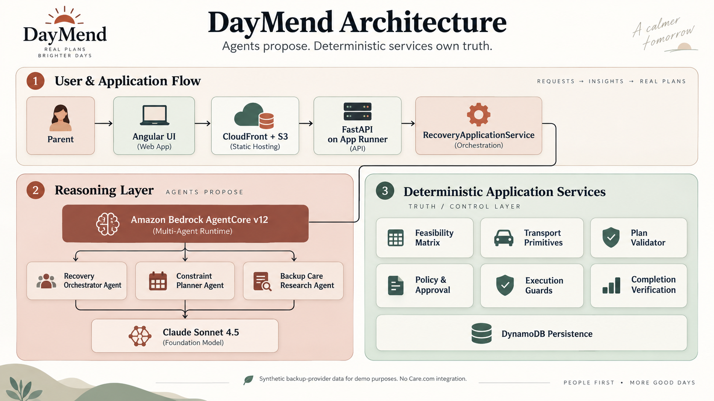

# DayMend architecture

> **Agents propose. Deterministic services own truth.**



## Submitted system

DayMend has one application lifecycle and three durable reasoning roles:

```text
Browser
  → Angular on CloudFront/S3
  → FastAPI on App Runner
  → RecoveryApplicationService
  → Amazon Bedrock AgentCore Runtime (deployed v12)
      → Recovery Orchestrator Agent
      → Constraint Planner Agent
      → Backup Care Research Agent, conditionally
      → Claude Sonnet 4.5 on Amazon Bedrock

FastAPI application services
  → feasibility normalization
  → PlanValidator
  → policy and approval
  → execution guards
  → completion verification
  → DynamoDB RecoveryCase persistence/versioning
```

The AgentCore runtime is stateless. FastAPI sends a versioned `AgentRuntimeRequest` containing the
operation and authoritative scenario contract. AgentCore returns structured reasoning artifacts;
it does not own persistence, approval, execution, or lifecycle state.

The production inference profile is
`us.anthropic.claude-sonnet-4-5-20250929-v1:0`. The runtime is Python 3.12 and hosts exactly three
Strands agents—deterministic services are not agents.

## RecoveryCase is the source of lifecycle state

Every disruption creates one persistent, versioned `RecoveryCase` containing:

- the disruption and authoritative world state;
- active and previous plans;
- assumptions and invalidations;
- external events;
- pending and completed approvals;
- execution actions and results;
- timestamps and lifecycle status.

External responses update the same case. A caregiver decline invalidates only dependent
assumptions and segments, calculates uncovered windows, preserves materially identical segments,
and starts Plan B from the updated state. Approval also resumes the same case. Optimistic version
checks prevent stale events or approvals from overwriting newer state.

Accepted plan IDs are application-owned lifecycle identifiers. Model-provided IDs are not trusted,
and Plan A remains addressable after Plan B becomes active.

## Reasoning roles

### Recovery Orchestrator Agent

The Orchestrator interprets the disruption or replanning context and produces a focused
`PlanningBrief`. It coordinates the reasoning operation but cannot validate or execute a plan.

### Constraint Planner Agent

The Planner composes a complete structured `RecoveryPlan`. Initial proposals use normalized
feasibility primitives. When a preservation-aware feasible matrix can represent the complete
repaired day, the Planner instead selects stable primitive IDs. Required immutable IDs preserve
surviving segments, and application code materializes exact plan details from authoritative
primitives before validation. Replanning that requires calendar changes not represented by
primitives retains the complete-plan contract. Repair proposals receive the shared invocation
contract:

- authoritative context or normalized initial matrix;
- `PlanningBrief`;
- previous candidate;
- exact safe validator issue code, message, and context;
- affected and preserved windows;
- operation type.

Local and AgentCore paths use the same canonical input and renderer. Correctness does not depend on
retained conversation history. The Planner may produce at most three proposals for one planning
session.

### Backup Care Research Agent

Deterministic analysis invokes research only when known family options cannot produce a complete
feasible path through the affected window. The agent ranks hard-eligible records from a synthetic
provider fixture. A deterministic post-research planability gate rejects candidates that cannot
join the preserved plan before Planner execution. A viable recommendation becomes authoritative
Planner and validator context, but it cannot bypass trust, coverage, cost, or approval rules.

Harbor Nanny Coop and all provider records are fictional. There is no integration with Care.com or
another provider marketplace.

## Deterministic feasibility

Initial planning does not ask the model to reconcile duplicated raw context. Application code
derives a `FeasibleAssignmentMatrix` from the five authoritative context categories:

- required childcare window;
- parent calendars and movable/critical events;
- caregiver eligibility and availability;
- family preferences;
- hard family policy.

Care primitives include only eligible people and permitted windows. A
`FeasibleTransportPrimitive` binds:

- transporter ID;
- permitted start/end window;
- origin and destination;
- required route duration;
- `capability = ALLOWED`.

Incapable transporters and routes that do not fit an authorized window are excluded. For initial
planning, Claude composes the plan from feasible context. For a preservation-aware replan with a
complete matrix, Claude selects primitive IDs and the application deterministically materializes
their authoritative segment details. Deterministic code does not choose the candidate combination.

## Validation and bounded repair

The independent `PlanValidator` checks:

- continuous childcare coverage;
- caregiver trust and availability;
- calendar overlap and required movable-event actions;
- location continuity;
- travel duration and transporter availability;
- handoff feasibility;
- hard policy and supported assumptions.

The model sets candidates to `NOT_VALIDATED`. Deterministic code validates each proposal and, when
invalid, returns safe structured issues for repair. The loop stops on the first valid plan or after
`MAX_PLAN_ATTEMPTS = 3`. Validation rules and the cap are never changed to obtain a pass.

## Approval, execution, and completion

Cost is calculated deterministically. A valid plan may still require approval because it exceeds
the `$30` automatic-spend threshold or introduces another consequential action.

Approval permits guarded, idempotent simulated actions. Rejection records `REJECTED`, runs no
actions, and cannot become `RESOLVED`. After approval, each action result is recorded. Only the
completion verifier may transition the case to `RESOLVED`, and only after revalidating final
coverage against current state.

## Live progress and observability

The browser creates a safe progress correlation ID, opens SSE, and then issues the mutation with
`X-DayMend-Progress-ID`. The backend accepts a fresh empty channel, emits reviewed structured
events, and exposes an HTTP snapshot for reconnect. The frontend merges and deduplicates events by
ID.

Progress and logs contain operation names, attempt counts, issue codes, invocation counts, costs,
and action outcomes. They never include credentials, raw prompts, hidden reasoning, or
chain-of-thought.

At the AgentCore boundary, one retry is allowed only for connection-closed, connection-timeout, or
endpoint-connection failures. It reuses the same payload, logical request ID, and runtime session
ID. Read timeouts, authorization errors, application failures, malformed responses, validation,
approval, and execution errors are not retried.

## Deployment boundaries

- CloudFront serves the Angular bundle from a private S3 origin.
- App Runner hosts FastAPI and owns the application/runtime boundary.
- AgentCore hosts only the three-agent reasoning layer.
- Bedrock serves Claude Sonnet 4.5 through the configured inference profile.
- DynamoDB stores complete versioned recovery aggregates.
- CloudWatch receives safe backend and AgentCore telemetry.
- IAM grants App Runner invocation permission on the exact AgentCore parent runtime and `DEFAULT`
  endpoint ARNs.

See [deployment.md](deployment.md) for the deployed configuration and [demo-flow.md](demo-flow.md)
for the verified lifecycle.
